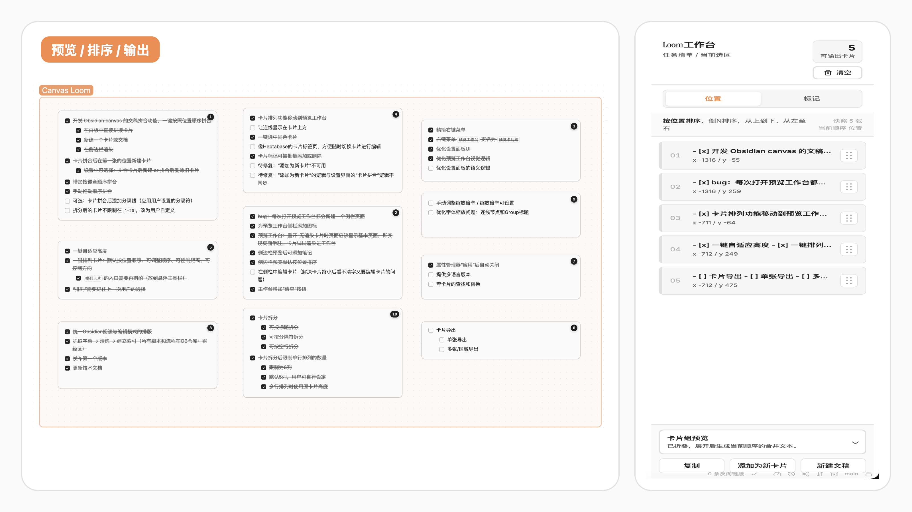
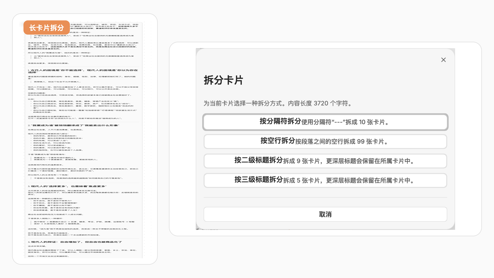
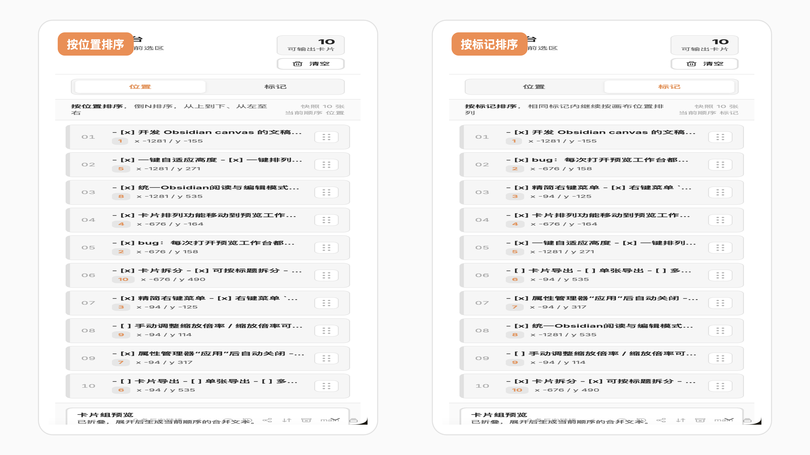
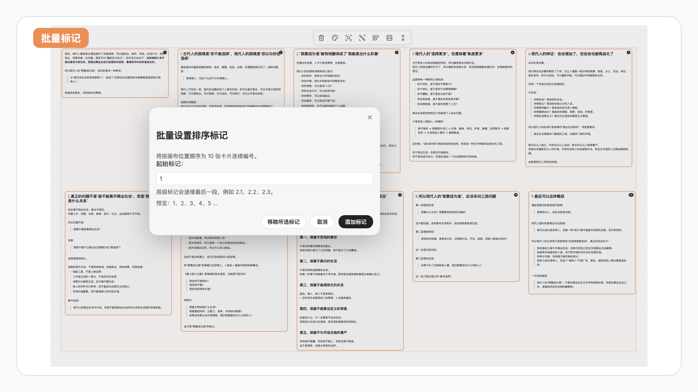
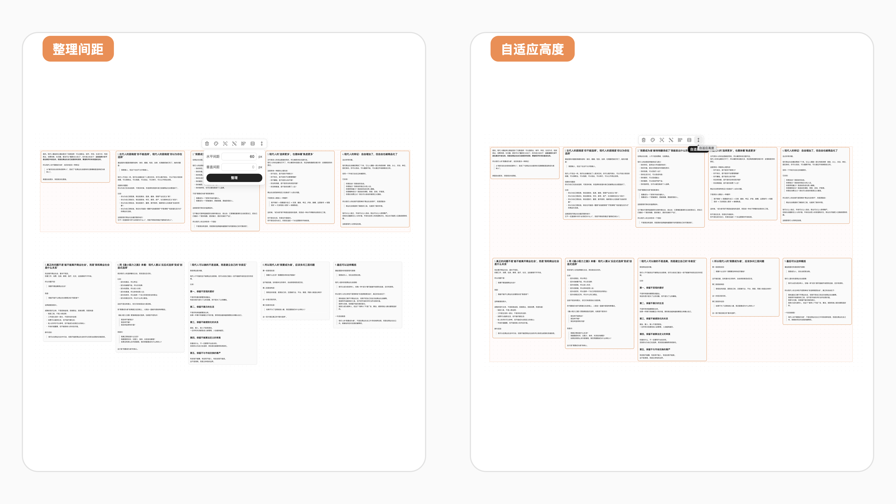

# Canvas Loom

Canvas Loom 现在支持英文和简体中文界面，会根据用户的 Obsidian 语言设置自动切换。

`Canvas Loom` 是一个 Obsidian Canvas 增强插件，用来拆分、排序、拼合、预览和整理 Canvas 文本卡片。

它把零散的 Canvas 文本卡片变成一条可重复的工作流：长文拆成卡片，多卡片按位置或序号排序，先预览再导出，最后把卡片尺寸和间距整理干净。

## 语言支持

默认语言为**自动**：Obsidian 使用中文环境时显示简体中文，其他语言环境显示英文。也可以在插件设置里手动选择 **English** 或 **简体中文**。

## 界面总览



Canvas Loom 的核心路径是：先选中 Canvas 卡片，载入 Loom 工作台，调整顺序，预览拼合文本，再输出到剪贴板、Canvas 新卡片或 Markdown 文稿。

演示视频：[预览工作台、复制、新建文稿、新建卡片](Demo/侧栏工作台：预览卡片组_复制_新建文稿_新建卡片_清空.mp4)

## 核心工作流

### 拆分卡片



单张长文本卡片可以按自定义分隔符、空行或 Markdown 标题层级拆分。插件会保留原卡片，并把后续内容追加成新的 Canvas 卡片。

演示视频：[按分隔符、空行或标题层级拆分卡片](Demo/卡片拆分_三种拆分方式_限制拆分后的单行卡片数量.mp4)

### 拼合卡片


选中多张卡片后，可以直接一键拼合，也可以先载入 Loom 工作台——一个三面板侧栏（预览/排序/查找替换），切换排序、搜索、预览结果，再输出到剪贴板、Canvas 新卡片或 Markdown 文稿。

演示视频：[拼合选中的 Canvas 卡片](Demo/一键拼合：拼合后是否保存原卡片_按位置or标记顺序拼合.mp4)

### 按位置或序号排序



位置排序跟随画布上的视觉排布。序号排序优先读取卡片第一行序号，没有时回退到独立数字标记；两者都没有的卡片排在最后并按画布位置排序。

演示视频：[按位置排序和按序号排序的区别](Demo/预览卡片组：按位置排序和按标记排序的区别.mp4)

### 标记卡片



可以给单张卡片添加或编辑数字标记。多选文本卡片后，点击选区浮动工具栏中的标记按钮，可以批量编号或直接移除已有标记；混合选区默认只给无标记卡片编号。标记独立于卡片内容，并作为序号排序的回退来源。

演示视频：[按位置顺序添加标记](Demo/添加卡片标记_两种按位置排序添加标记的效果.mp4)

### 整理版面



让卡片高度适配文本内容，并对选中的多张卡片整理水平或垂直间距，减少重复拖拽。

演示视频：[自适应高度并整理卡片间距](Demo/自适应高度_调整间距.mp4)

### 导出卡片图片

右键单张文本卡片可以直接选择文件夹并导出 PNG；在 Loom 工作台的 `预览` 面板中点击 `导出图片`，也会先选择仓库内的保存文件夹。工作台图片采用当前卡片顺序、分隔符和预览文本，不按 Canvas 空间位置截图。

### 画布内查找与替换

跨当前画布所有文本卡片或选区内搜索和替换文本。点击画布右上角工具栏的搜索按钮或使用 `Ctrl+F`（macOS）快捷键打开浮动查找替换面板。如需边看边操作，可打开 Loom 工作台并切换到**查找**选项卡——结果以可滚动列表展示，含匹配预览；点击结果或切换上/下一个匹配时，会定位到对应卡片并临时高亮当前命中。支持替换当前匹配、当前卡片内全部匹配、或画布内全部匹配。支持区分大小写和正则表达式匹配。

## 功能概览

- `拆分卡片...`
  支持按自定义分隔符、空行或 Markdown 标题层级拆分。
- `预览卡片组`
  将选中的文本卡片组载入 Loom 工作台，可在预览、排序、查找替换三个面板间切换；切换排序、拖拽微调当前顺序、预览结果，并输出为剪贴板、画布卡片或 Markdown 文稿。
- `画布内查找与替换`
  跨画布所有文本卡片或当前选区内搜索，支持正则和大小写匹配。逐条导航匹配项，定位到对应卡片并临时高亮当前命中，支持替换当前匹配、当前卡片内全部匹配、或画布内全部匹配。
- `一键复制` / `一键拼合`
  按设置中的默认排序方式处理多张卡片。
- `导出图片`
  在 Loom 工作台的预览面板中，将当前预览结果导出为 PNG，并选择保存文件夹。
- `导出卡片图片`
  在单张文本卡片的右键菜单中，将该卡片导出为 PNG，并选择保存文件夹。
- `添加/编辑标记`
  支持 `1`、`2.1`、`10.3.2` 这类数字层级标记。
- `序号工具`
  在 Canvas 选区浮动工具栏中批量编号或移除已有标记。
- `管理卡片属性`
  统一处理单卡片查看，以及多卡片批量尺寸和宽高比调整。
- `整理间距` / `自适应高度`
  在 Canvas 选区浮动工具栏中整理卡片排布。
- `选中同色卡片`
  从单张或多张卡片出发，选中同色文本卡片，也可以进入同色分组预览。

## 插件设置

- `语言`：控制插件界面跟随 Obsidian 自动切换，或固定使用 English / 简体中文
- `设置画布卡片分隔符`：控制分隔符拆分使用的文本，也可作为拼合分隔线
- `拼合时插入分隔线`：控制多卡片输出时是否在相邻卡片之间插入当前分隔符
- `设置卡片排序优先级`：控制位置排序优先按纵向还是横向
- `一键排序方式`：控制一键复制和一键拼合的默认排序模式
- `拼合后处理方式`：控制拼合为新卡片后保留或删除原卡片
- `启用标记功能`：控制是否显示卡片标记
- `连线显示在卡片上方`：空闲时让连线显示在普通卡片上方，选中或编辑卡片时自动让卡片压过连线，不修改 Canvas 文件
- `连线标签和 Group 标题可读性补偿`：控制标签抵抗 Canvas 缩放变化的程度，100% 尽量保持默认可读大小
- `在画布内显示缩放控件`：在 Canvas 内显示 10%-200% 缩放控件，包含滑块、百分比输入框和微调按钮
- `启用 Canvas 性能模式`：降低大型 Canvas 中 Canvas Loom 的附加渲染开销，并在低缩放时把标记降级为小圆点
- `启用性能诊断日志`：在开发者控制台输出操作耗时和节点统计
- `大 Canvas 阈值` / `标记更新防抖时间`：控制标记分帧更新策略，并影响性能模式下标记降级的触发缩放

## 权限与隐私说明

- 插件功能不需要账号或付费服务
- 不包含广告，不采集遥测数据，不上传用户内容
- 不主动联网
- 仅在用户手动触发命令时，读取当前 Obsidian 仓库中的 Canvas 或 Markdown 内容
- 仅在用户明确执行导出、拼合或新建文稿相关操作时，在当前仓库内创建或修改文件
- 仅在用户主动执行复制操作时向系统剪贴板写入生成的文本
- 不读取系统剪贴板，也不会访问从 Obsidian 外部复制的内容

## 支持开发

如果 Canvas Loom 对你有帮助，可以查看 [联系与支持开发](./docs/support/support.md)。

## 安装

### 从 GitHub 发布页安装

1. 打开本仓库的 [发布页](https://github.com/woxin667/Canvas-Loom/releases)
2. 下载 `main.js`、`manifest.json`、`styles.css`
3. 将这三个文件放入 `.obsidian/plugins/canvas-loom/`
4. 在 Obsidian 中启用插件

### 本地构建

```bash
npm install
npm run build
```

## 开发

- `npm run dev`：开发模式
- `npm run build`：生产构建
- `npm run version`：同步更新版本号

## 文档

文档索引见 [docs/README.md](./docs/README.md)。

建议优先阅读：

- `docs/功能-拆分Canvas卡片.md`
- `docs/功能-卡片内容复制与排序.md`
- `docs/功能-卡片标记.md`
- `docs/功能-Canvas缩放控件.md`
- `docs/功能-查看和编辑卡片属性.md`
- `docs/功能-Canvas卡片查找替换.md`
- `docs/功能-卡片图片导出.md`
- `docs/技术实现细节.md`
- `docs/技术实现-Obsidian官方上架与发布流程.md`

## 致谢

早期开发参考了 **joshuakto** 的开源项目 [obsidian-cardify](https://github.com/joshuakto/obsidian-cardify)。
