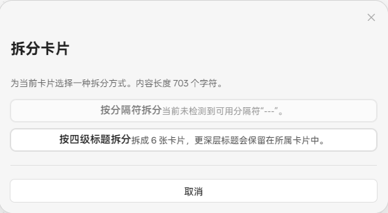
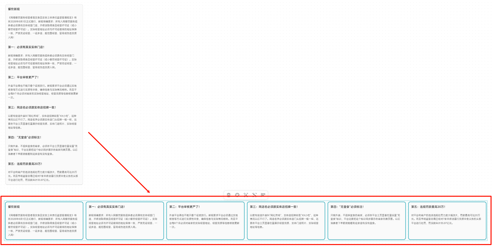
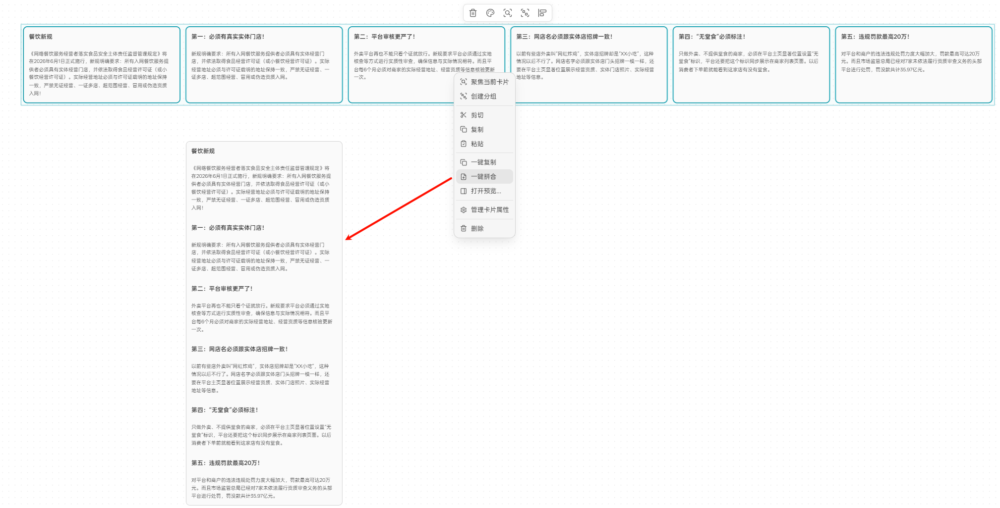
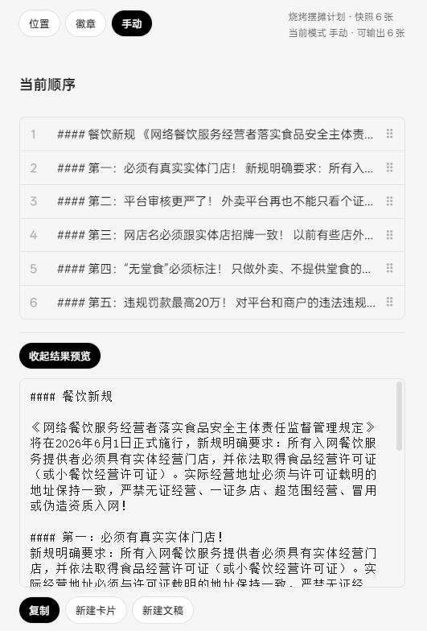
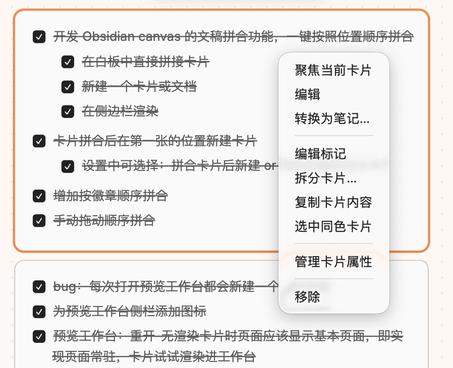
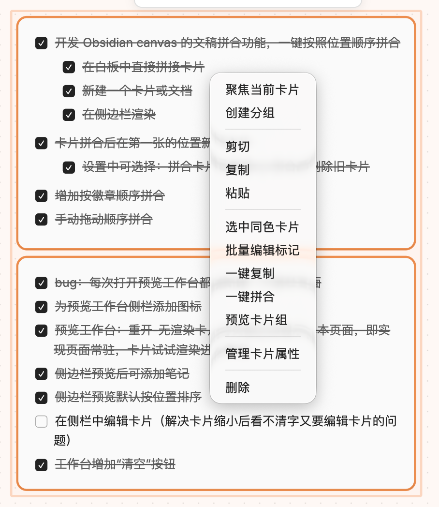
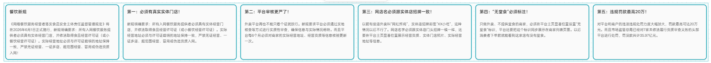
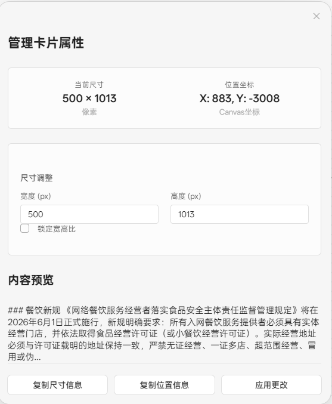
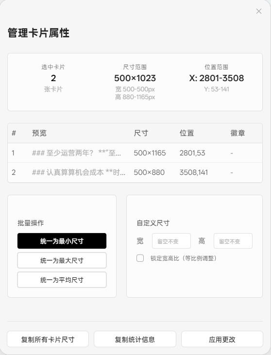

# Canvas Loom

`Canvas Loom` 是一个 Obsidian Canvas 增强插件，聚焦 Canvas 中几类高频整理操作：

- 拆分单张文本卡片
- 复制、拼合和预览多张卡片内容
- 为卡片添加标记
- 查看、调整和排列卡片属性
- 按颜色选择卡片并进入分组预览

English: [README.md](./README.md)

当前版本：`1.5.2`

## 功能概览

- `拆分卡片...`
  支持按自定义分隔符或 Markdown 标题层级拆分。
- `复制卡片内容`
  复制单张文本卡片的纯文本内容。
- `一键复制` / `一键拼合`
  按设置中的默认排序方式处理多张卡片。
- `预览卡片组`
  将当前选中的文本卡片组载入 Loom 工作台，切换排序、拖拽微调当前顺序、预览结果，并输出为剪贴板、画布卡片或 Markdown 文稿。
- `添加/编辑标记`
  支持 `1`、`2.1`、`10.3.2` 这类数字层级标记。
- `管理卡片属性`
  统一处理单卡片查看，以及多卡片批量尺寸、宽高比和排列调整。
- `选中同色卡片`
  从单张或多张卡片出发，选中同色文本卡片，也可以进入同色分组预览。

## 界面演示

下面这组截图适合直接放在主页，基本能把插件的主要使用路径说明白。

### 1. 拆分文本卡片

<p align="center">
  
  
</p>

单张长文本卡片可以先选择拆分方式，再按分隔符或 Markdown 标题层级拆成多张新卡片。

### 2. 多卡片整理与导出

<p align="center">
  
  
</p>

选中多张卡片后，可以直接一键拼合，也可以用 `预览卡片组` 载入 Loom 工作台，切换排序模式、预览结果，并输出到剪贴板、画布卡片或 Markdown 文稿。

### 3. 右键菜单入口

<p align="center">
  
  
  
</p>

单卡片和多卡片场景分别提供不同的右键操作入口，批量整理后的画布效果也能直接在画布中看到。

### 4. 卡片属性管理

<p align="center">
  
  
</p>

属性管理支持查看尺寸和坐标、复制位置信息，以及对多张卡片执行统一最小尺寸、最大尺寸或平均尺寸等批量调整。

## 插件设置

- `设置画布卡片分隔符`：控制分隔符拆分使用的文本
- `设置卡片排序优先级`：控制位置排序优先按纵向还是横向
- `一键排序方式`：控制一键复制和一键拼合的默认排序模式
- `拼合后处理方式`：控制拼合为新卡片后保留或删除原卡片
- `启用标记功能`：控制是否显示卡片标记
- `启用 Canvas 性能模式`：降低大型 Canvas 中 Canvas Loom 的附加渲染开销
- `启用性能诊断日志`：在开发者控制台输出操作耗时和节点统计
- `大 Canvas 阈值` / `标记更新防抖时间`：控制标记分帧更新策略

## 权限与隐私说明

- 不需要账号，不接入付费服务
- 不包含广告，不采集遥测数据，不上传用户内容
- 不主动联网
- 仅在用户手动触发命令时，读取当前 Obsidian 仓库中的 Canvas 或 Markdown 内容
- 仅在用户明确执行导出、拼合或新建文稿相关操作时，在当前仓库内创建或修改文件
- 支持将选中卡片内容复制到系统剪贴板

## 安装

### 从 GitHub 发布页安装

1. 打开本仓库的 [发布页](https://github.com/woxin667/Canvas-Loom/releases)
2. 下载 `main.js`、`manifest.json`、`styles.css`
3. 将这三个文件放入 `.obsidian/plugins/canvas-loom/`
4. 在 Obsidian 中启用插件

### 本地构建

```bash
npm install
npm run build
```

## 开发

- `npm run dev`：开发模式
- `npm run build`：生产构建
- `npm run version`：同步更新版本号

## 文档

文档索引见 [docs/README.md](./docs/README.md)。

建议优先阅读：

- `docs/功能-拆分Canvas卡片.md`
- `docs/功能-卡片内容复制与排序.md`
- `docs/功能-卡片标记.md`
- `docs/功能-查看和编辑卡片属性.md`
- `docs/技术实现细节.md`
- `docs/技术实现-Obsidian官方上架与发布流程.md`

## 致谢

早期开发参考了 **joshuakto** 的开源项目 [obsidian-cardify](https://github.com/joshuakto/obsidian-cardify)。
