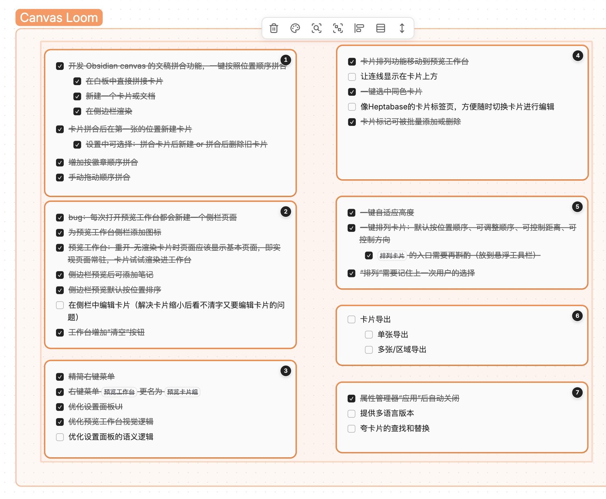
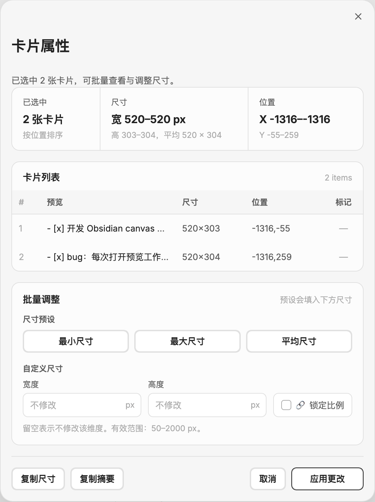
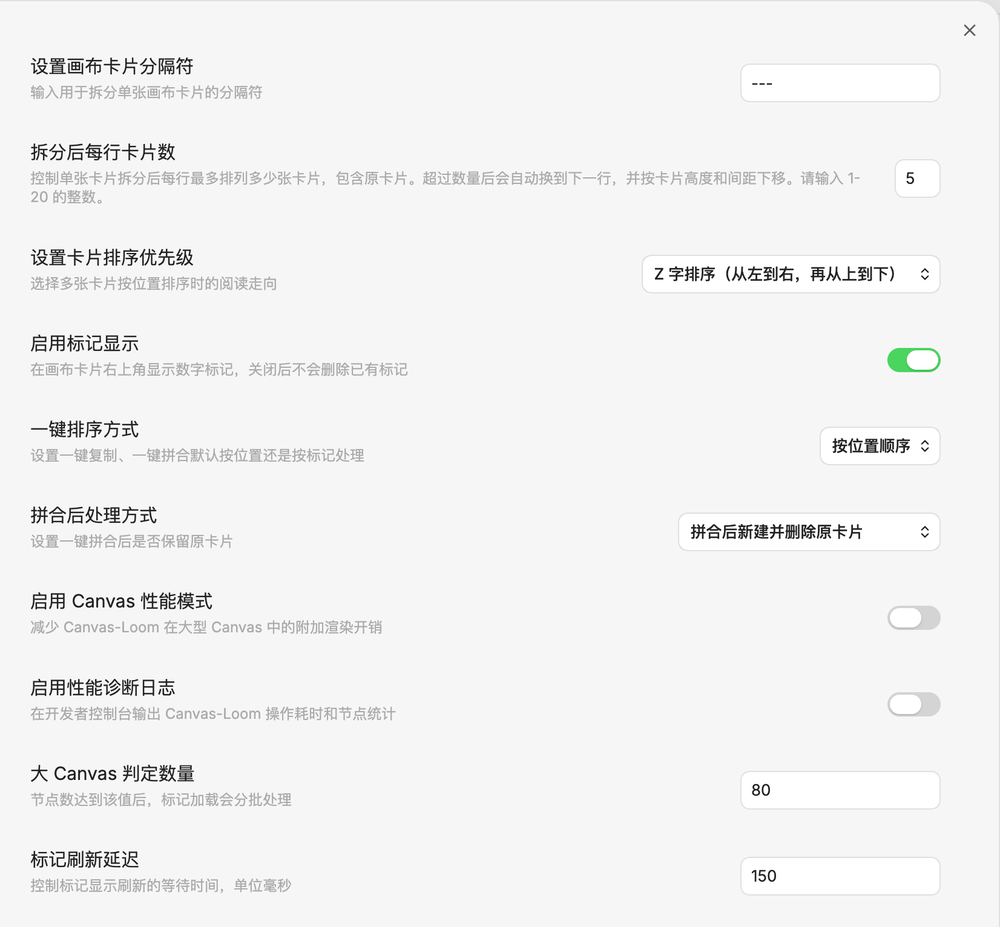

# Canvas Loom

官方要求介绍必须是英文，中文版介绍请看：[README-ZH.md](./README-ZH.md)

Multi-language versions will be launched in the future, so stay tuned!

Canvas Loom is an Obsidian Canvas plugin for splitting, sorting, merging, previewing, and cleaning up Canvas text cards.

It turns scattered Canvas text cards into a repeatable workflow: split long notes into cards, sort selected cards by position or badge, preview the merged result, export it, and clean up the layout without leaving Canvas.

## Hero Demo

<video src="Demo/侧栏工作台：预览卡片组_复制_新建文稿_新建卡片_清空.mp4" controls muted width="100%"></video>

## Core Workflows

### Split Cards

<video src="Demo/卡片拆分_三种拆分方式_限制拆分后的单行卡片数量.mp4" controls muted width="100%"></video>

Split one long text card by a custom delimiter, blank lines, or Markdown heading level. Canvas Loom keeps the original card in place and creates the remaining content as new Canvas cards.

### Merge Cards

<video src="Demo/一键拼合：拼合后是否保存原卡片_按位置or标记顺序拼合.mp4" controls muted width="100%"></video>

Merge selected cards directly, or send them to the Loom workspace first to sort, preview, and export the final text.

### Sort by Position or Badge

<video src="Demo/预览卡片组：按位置排序和按标记排序的区别.mp4" controls muted width="100%"></video>

Position sorting follows the visual layout of the Canvas. Badge sorting follows numeric badges such as `1`, `2.1`, or `10.3.2`, so output order can stay stable even when card positions change.

### Clean Layout

<video src="Demo/自适应高度_调整间距.mp4" controls muted width="100%"></video>

Resize cards to fit their text and arrange selected cards with cleaner horizontal or vertical spacing.

## Screenshots

<table>
  <tr>
    <td width="50%"></td>
    <td width="50%"></td>
  </tr>
  <tr>
    <td width="50%"></td>
    <td width="50%"></td>
  </tr>
</table>

## Feature Overview

- `Split card...`
  Split one text card by a custom delimiter, blank lines, or Markdown heading level.
- `Preview card group`
  Load selected text cards into the Loom workspace, change sorting, drag-adjust the current order, preview merged output, and export it.
- `Quick copy` / `Quick merge`
  Process selected cards with the default sorting mode from settings.
- `Add/Edit badge`
  Add numeric outline-style badges such as `1`, `2.1`, or `10.3.2`.
- `Manage card properties`
  Inspect one card or batch-adjust selected card dimensions, width, height, aspect ratio, and layout.
- `Arrange spacing` / `Auto-fit height`
  Clean up selected Canvas cards with toolbar actions.
- `Select same color cards`
  Select text cards with the same Canvas color and open them in the preview workflow.

## Settings

- `Canvas card delimiter`: controls the delimiter used when splitting cards.
- `Card sorting priority`: controls whether position-based sorting prioritizes vertical or horizontal order.
- `Quick action sorting mode`: controls the default sorting mode for quick copy and quick merge.
- `Enable badges`: controls whether card badges are shown.
- `Merge cleanup mode`: controls whether source cards are kept or deleted after creating a merged card.
- `Canvas performance mode`: reduces Canvas Loom's additional rendering cost on large canvases.
- `Performance diagnostics`: logs Canvas Loom operation timing and Canvas statistics to the developer console.

## Privacy

- No account required
- No paid service integration
- No ads, telemetry, or uploaded user content
- No proactive network access
- Reads Canvas or Markdown content only when the user runs a command
- Creates or modifies files in the current vault only when the user explicitly exports, merges, or creates a note
- Supports copying selected card content to the system clipboard

## Installation

### Install from GitHub Releases

1. Open the repository [Releases page](https://github.com/woxin667/Canvas-Loom/releases).
2. Download `main.js`, `manifest.json`, and `styles.css`.
3. Put the three files in `.obsidian/plugins/canvas-loom/`.
4. Enable the plugin in Obsidian.

### Build Locally

```bash
npm install
npm run build
```

## Development

- `npm run dev`: development build
- `npm run build`: production build
- `npm run version`: sync version metadata

## Documentation

The documentation index is available at [docs/README.md](./docs/README.md).

Suggested reading:

- `docs/功能-拆分Canvas卡片.md`
- `docs/功能-卡片内容复制与排序.md`
- `docs/功能-卡片标记.md`
- `docs/功能-查看和编辑卡片属性.md`
- `docs/技术实现细节.md`
- `docs/技术实现-Obsidian官方上架与发布流程.md`

## Credits

Early development referenced **joshuakto**'s open-source project [obsidian-cardify](https://github.com/joshuakto/obsidian-cardify).
